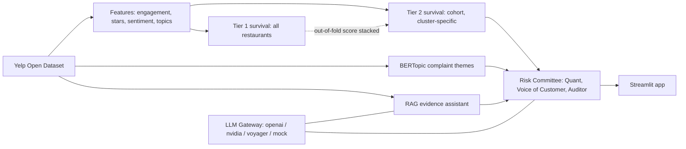

# Location Risk Radar

**Early warning for restaurant locations, explained by customer evidence.**

[](https://github.com/SyedHunainAkbar/location-risk-radar/actions/workflows/ci.yml)
[](https://www.python.org/downloads/release/python-3110/)
[](LICENSE)
[](app/streamlit_app.py)

We flag restaurant chain locations at elevated risk of closure and explain why using
the language of customer reviews. The default operating metric, average star rating,
barely separates survivors from closures, so we build the signal from engagement
dynamics and review text instead.

- App: runs locally with `streamlit run app/streamlit_app.py` (see Run the app below)
- Final notebook: [`notebooks/Location_Risk_Radar_Final.ipynb`](notebooks/Location_Risk_Radar_Final.ipynb)

## 30-second summary

We model a locked cohort of 30 restaurant chains (15 Fast Food, 15 Non-Fast Food)
from the Yelp Open Dataset. A landmark survival model estimates each location's
closure risk over the next 24 months using only data from before the landmark date.
BERTopic surfaces complaint themes, a retrieval assistant answers operator questions
from cited reviews, and a three-agent Risk Committee writes an auditable Location
Risk Brief. Every model call goes through one LLM gateway, and the Streamlit app
reads only small precomputed artifacts so it runs in about 1 GB of memory and works
with no API key.

## The business problem

Chains with many locations need to know which ones are slipping before they close.
Managers lean on the average star rating, but in our data the mean rating of open and
closed restaurants differs by only about **0.03 stars**. The default KPI is nearly
blind to closure. The signal lives in engagement dynamics (review, check-in, and tip
volume and recency) and in the language of reviews, modeled separately for the two
clusters.

## Architecture



## Headline results

<!-- HEADLINE-METRICS:START -->
_Headline metrics are generated from `artifacts/model_metrics.parquet`._

Run the pipeline (`pipeline/04_features.py` then `05_survival.py` and `05b_tier1_survival.py`) and re-run `python scripts/generate_metrics_table.py` to populate this table with the C index, time-dependent AUC, and integrated Brier score, each with 95% confidence intervals. We never hand-type these numbers.

<!-- HEADLINE-METRICS:END -->

## How to reproduce

The raw Yelp data is not included (academic license). Download it yourself.

1. **Get the data.** Download the Yelp Open Dataset from
   https://www.yelp.com/dataset and extract the JSON files (business, review, tip,
   checkin).
2. **Point the pipeline at it.** Set `YELP_DIR` to the folder with the JSON files
   (copy `.env.example` to `.env` and fill in `YELP_DIR`).
3. **Install.** For the full pipeline use `pip install -r requirements-offline.txt`
   (it includes `requirements.txt` and adds the heavy offline stack: scikit-survival,
   xgboost, shap, lifelines, spaCy, sentence-transformers, BERTopic, TensorFlow).
   The deployed app installs only `requirements.txt`.
4. **Run the pipeline in order.** Approximate runtimes on a laptop; the review file
   is about 5 GB.

   | Stage | Script | What it does | Approx time |
   |---|---|---|---|
   | 01 | `pipeline/01_ingest_cohort.py` | Build the 30-chain cohort | 2-3 min |
   | 01b | `pipeline/01b_corpus_ingest.py` | Streaming corpus panel | 5-8 min |
   | 02 | `pipeline/02_text_sentiment.py` | Lexicons + classical sentiment | 3-5 min |
   | 02b | `pipeline/02b_deep_sentiment_colab.py` | GRU/LSTM benchmark (GPU) | offline |
   | 02c | `pipeline/02c_corpus_sentiment.py` | Non-cohort scorer + transfer | 10-15 min |
   | 03 | `pipeline/03_topics_colab.py` | BERTopic themes (GPU) | offline |
   | 04 | `pipeline/04_features.py` | Leakage-safe feature matrix | 2-4 min |
   | 04b | `pipeline/04b_tier1_features.py` | Tier 1 corpus features | 3-5 min |
   | 05 | `pipeline/05_survival.py` | Cohort survival + risk scores | 3-6 min |
   | 05b | `pipeline/05b_tier1_survival.py` | Tier 1 ablation + OOF scores | 3-5 min |
   | 05c | `pipeline/05c_tier2_stack.py` | Tier 2 stacking | 2-3 min |
   | 06 | `pipeline/06_aspects_rag.py` | Aspect agents + RAG index | 10-20 min |
   | 08 | `pipeline/08_eval_agents.py` | Risk Committee briefs + eval | 5-10 min |

5. **Generate the metrics table.** `python scripts/generate_metrics_table.py`.

## Run the app locally

```bash
pip install -r requirements.txt
streamlit run app/streamlit_app.py
```

The app works with no API key (Cached mode). To enable Live mode, set a provider key
(`OPENAI_API_KEY`, `NVIDIA_API_KEY`, or `VOYAGER_API_KEY`) in your environment or
`.streamlit/secrets.toml`. Keys are read only from those sources and are never logged.

### Deployment and memory

The app reads precomputed artifacts only and is built to run in 1 GB RAM on Streamlit
Community Cloud. `requirements.txt` deliberately excludes torch, scikit-survival, spaCy,
BERTopic, and TensorFlow; the app reads their precomputed outputs instead. In Cached
mode the app peaks near 100 MB. Live free-text RAG embeds the user query with a CPU-only
ONNX MiniLM via `fastembed` (no torch), so the embedding step stays light.

## Repository structure

```
location-risk-radar/
  src/lrr/            # importable library: config, io, cohort, text, sentiment,
                      # topics, features, survival, evaluation, corpus, aspects,
                      # rag, gateway/, agents/
  pipeline/           # numbered, idempotent stages 01 to 08
  app/                # Streamlit app (entry, components, pages)
  notebooks/          # final deliverable notebook
  config/             # gateway.yaml routing, actions.yaml playbook
  docs/               # methodology, model card, agents, gateway, data dictionary
  artifacts/          # small committed outputs the app reads
  tests/              # pytest suite (unit + AppTest smoke)
  scripts/            # metrics-table generator
  .github/workflows/  # CI
```

## Limitations

- No `chain_id` in the data; chains are grouped by name normalization, imperfectly.
- Fast Food label noise: sit-down brands such as Chili's, Applebee's, and Denny's
  appear in the Fast Food cluster.
- `is_open` is a current status flag, not a closure date.
- Closure date is proxied by last observed activity, not a confirmed close date.
- Right censoring: locations still open at the window's end have unknown outcomes.
- Survivorship in text: reviews stop when a location stops, biasing late-period
  language.

See [docs/methodology.md](docs/methodology.md) and
[docs/model_card.md](docs/model_card.md) for the full treatment.

## Ethical use

This is decision support, not an automated closure decision. We surface locations
that merit a closer look, with the evidence attached, for a human to review.

## Team

Team LRR Analytics: Andy Lin, Hunain Akbar, Ishani Patel, Jake Ida, Yukti Gandhi.

Course: CIS 509, W. P. Carey School of Business, Arizona State University.

## Generative AI disclosure

We used [Kiro](https://kiro.dev) to scaffold the `src/lrr` package, the pipeline
stages, the Streamlit app, and the test suite. We used ChatGPT, Gemini, and Claude
for targeted prompt design, debugging, and wording. The aspect-agent pattern is
adapted from our TA's Yelp Aspect Agents reference, with credit. All numbers in the
repo are computed by our Python code from the artifacts; the LLM layer returns only
quotes and labels, and every number in a brief is filled in by Python.

## Data license

This project uses the Yelp Open Dataset under its academic terms
(https://www.yelp.com/dataset). The dataset is **not** included in this repository
and is not covered by the repository license. Download it directly from Yelp.

## License

Code is released under the [MIT License](LICENSE). The Yelp data is not covered by
this license.
